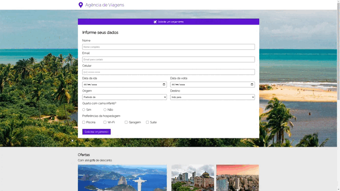

# Goal
 
The purpose of this project is to create the front-end of a dynamic web page using forms to send data from the front-end to the back-end.

For this, was used the HTML and CSS languages.

When creating this project, the following concepts were put into practice:

<ul>
  <li>HTML Forms</li>
</ul>

# Live demo

Link: [live-demo-vercel](https://travel-agency-six-pi.vercel.app/)

